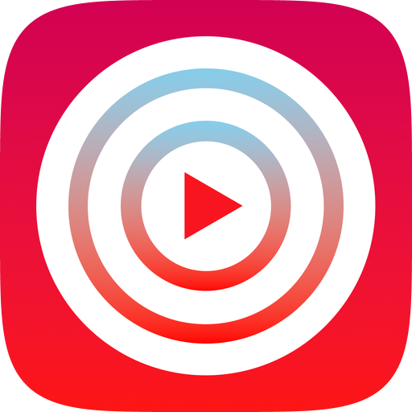

  

<h1 align="center">Side B</h1>

YouTube Music, with a desktop app of its own.

  <a href="https://github.com/fefucho/SIDE-B-CLIENT-NATIVE/releases">Download</a> ·
  <a href="#features">Features</a> ·
  <a href="#how-it-works">How it works</a> ·
  <a href="#thanks">Thanks</a>

Side B is a YouTube Music client for macOS and Windows. Browse your music, put an album on, and keep the player nearby while you do something else. Or open fullscreen and spend some time with the artwork, lyrics, and the story behind a song.

It started with the work of [Limusic](https://github.com/SimoHypers/limusic) and [Kaset](https://github.com/sozercan/kaset): Limusic provided the Rust backend foundations, and Kaset helped shape the Mac app and its native design. Side B builds on that work with its own interface and a shared backend for both platforms.

## Features

- **A Home that feels like your library.** Speed Dial, featured albums and playlists, recommendations, and controls for what appears on your Home page.
- **Search and discovery.** Find songs, artists, albums, and playlists; explore new releases, charts, moods, and genres.
- **Your YouTube Music account.** Access liked songs, playlists, saved albums, and listening history. Create and edit playlists, add tracks, and manage your collection.
- **A queue you can work with.** Reorder tracks, shuffle, repeat, and keep listening with song radio and recommendations.
- **Fullscreen listening.** Large artwork, backgrounds drawn from the cover's colors, and the queue and lyrics close at hand.
- **Lyrics and Genius.** Synced lyrics when available, line annotations, song information, and credits.
- **Everyday desktop controls.** A compact player, keyboard shortcuts, media keys, and system playback controls.
- **English and Spanish.** Change the interface language in settings.

The two apps share the same main features, with a few settings and system integrations specific to each platform. Side B is still being actively developed, so some edges are rough.

## Design

Album artwork has a lot of room here. Its colors carry into the background, while track lists and controls stay easy to read. The compact player leaves room to browse; fullscreen brings the current song, lyrics, and queue together.

On Mac, the interface uses SwiftUI and AppKit. Windows follows the same layout and visual direction, using Svelte and Tauri. Each app uses its platform's playback engine and desktop controls.

<!-- Add current native Home/fullscreen screenshots here; see docs/screenshots/README.md. -->

## Download

Get builds from the [Releases page](https://github.com/fefucho/SIDE-B-CLIENT-NATIVE/releases). Choose the files listed for your platform; beta builds are marked as prereleases.

| Platform | Requirements | Package |
|---|---|---|
| macOS | Apple Silicon, macOS 15 or later | `SideB-macOS.zip` |
| Windows | 64-bit Windows 10 or later, WebView2 | `SideB-Windows-x64-setup.exe` or `SideB-Windows-x64.zip` |

On Mac, unzip the download and move **Side B.app** to Applications. Builds are currently ad-hoc signed rather than notarized; if macOS blocks the first launch, use **System Settings → Privacy & Security → Open Anyway** after trying to open the app.

On Windows, use the installer or extract the entire portable ZIP. Keep the executable and its runtime files together. Sign in inside the app to access your personal YouTube Music library and recommendations.

## How it works

Both apps use a shared **Rust core** running on your computer. It talks to YouTube Music through **InnerTube**, handles search and metadata, resolves audio streams, and uses **SQLite** for local storage. You don't need to run a separate Side B server.

The Mac app connects to that core through **UniFFI** and plays audio with **AVPlayer**. The Windows app uses **Tauri** to connect its **Svelte/TypeScript** interface to Rust and plays audio with **libmpv**. Lyrics and Genius information come from their respective providers.

The source is split into [`apple/`](apple/), [`windows/`](windows/), and [`core/`](core/). If you'd like to build or contribute, the [development guide](.agents/WORKFLOW.md) covers the setup and build commands.

## Thanks

Side B would not exist without these projects:

- **[Limusic](https://github.com/SimoHypers/limusic), by [SimoHypers](https://github.com/SimoHypers) and contributors.** The foundation for the Rust backend: InnerTube, stream handling, local storage, and much of the work needed to make YouTube Music playback possible outside the browser.
- **[Kaset](https://github.com/sozercan/kaset), by [sozercan](https://github.com/sozercan) and contributors.** An essential starting point and source of inspiration for the Mac app, its desktop interface, and the way it fits into macOS.

Thanks also to the people behind [RustyPipe](https://codeberg.org/ThetaDev/rustypipe), [UniFFI](https://github.com/mozilla/uniffi-rs), [Tauri](https://github.com/tauri-apps/tauri), [Svelte](https://github.com/sveltejs/svelte), and [mpv](https://github.com/mpv-player/mpv). A lot of work goes into these projects before an app like Side B can even start.

## Feedback and license

Found a bug or have an idea? [Open an issue](https://github.com/fefucho/SIDE-B-CLIENT-NATIVE/issues) and include your operating system, app version, and what happened. Screenshots help with UI issues.

Side B is open source under [GPL-3.0-or-later](LICENSE). Upstream acknowledgments and the preserved Kaset license are in [third-party notices](THIRD_PARTY_NOTICES.md).

Side B is an independent project and is not affiliated with YouTube or Google.

<!-- Internal contributor/agent instructions start at AGENTS.md and .agents/WORKFLOW.md. -->
